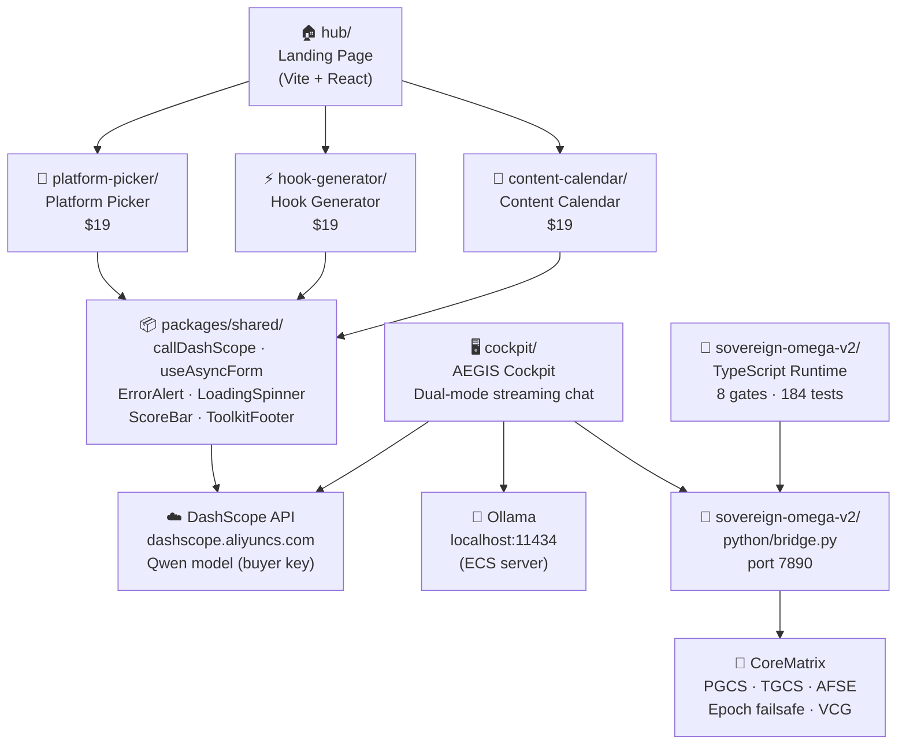

# AEGIS Architecture

## System Overview



## Products (Track B — Revenue)

| Product | Price | Stack | Deploy |
|---------|-------|-------|--------|
| Platform Picker | $19 | Vite + React + Tailwind + DashScope | Vercel |
| Hook Generator | $19 | Vite + React + Tailwind + DashScope | Vercel |
| Content Calendar | $19 | Vite + React + Tailwind + DashScope | Vercel |
| Bundle (any 2) | $29 | — | — |
| Full Toolkit (all 3) | $39 | — | — |

## Shared Infrastructure (`packages/shared/`)

| Module | Purpose |
|--------|---------|
| `lib/dashscope.ts` | Generic `callDashScope<T>()` — single DashScope fetch, JSON parse, fence-strip |
| `hooks/useAsyncForm.ts` | `idle → loading → results → error` state machine with `submit` / `reset` |
| `components/ErrorAlert.tsx` | Unified red error banner (lucide AlertCircle) |
| `components/LoadingSpinner.tsx` | Animated spinner with configurable color class and message |
| `components/ScoreBar.tsx` | Reusable 0–N score progress bar |
| `components/ToolkitFooter.tsx` | Cross-product "Also in the toolkit" footer strip |

## Sovereign Omega v2 (Track A — Governance)

```
TypeScript Runtime (src/)          Python Core Matrix (python/)
├── core/
│   ├── canonicalize.ts  Gate 1    ├── pgcs.py   — swap I/O criterion
│   ├── types.ts         Ω+H       ├── tgcs_afse.py — variance + R²
│   ├── ralph-loop.ts    Ω+H       ├── epoch_failsafe.py — crash guard
│   ├── invariant-checker.ts Ω+H  ├── gradient_anchor.py — β=0.9 EMA
│   └── fixedpoint.ts    Gate 6    ├── hardware_config.py — entropy math
├── event/                          ├── core_matrix.py — M1/M2/M3
│   ├── store.ts         Gate 2    └── bridge.py  — HTTP port 7890
│   └── uuid.ts          Gate 2          GET /telemetry · /telemetry/stream
├── gate/                               POST /event · /gate_signal
│   ├── hoeffding.ts     Gate 6          GET /health · /metrics · /snapshot
│   └── risk.ts          Gate 6
├── calibration/vcg.ts   Gate 5
├── projection/reducer.ts Gate 4
├── pipeline/
│   ├── index.ts         Gate 7
│   └── backpressure.ts  Ω+H
└── runtime/             Gate 8
```

### Holonic Extension Modules (Ω+H — added in 100-cycle evolution)

| Module | Holonic Scale | Invariants Added |
|--------|--------------|-----------------|
| `src/core/types.ts` | FIELD | HolonMetadata, HolonicScale, RalphCycle types |
| `src/core/ralph-loop.ts` | ORGANISM | Ralph cycle ledger, convergenceDepth() |
| `src/core/invariant-checker.ts` | ORGANISM | INV-01..INV-08, formatReport() |
| `src/pipeline/backpressure.ts` | MOLECULAR | HWM=1000/LWM=100, Little's Law |
| `python/hardware_config.py` | SUBATOMIC | Shannon entropy, KL divergence, MI |
| `python/epoch_failsafe.py` | CELLULAR | export/import checkpoint, entropy metrics |
| `python/tgcs_afse.py` | CELLULAR | throughput entropy, holonic_scaling_score |

Gate 8 validation: **202 tests, 20 test files, all passing.**

## Cockpit Telemetry Flow

```
sovereign-omega-v2/python/bridge.py
  └─ GET /telemetry (every 5s) ──→ cockpit/src/lib/telemetry.ts
                                      └─ subscribeTelemetry()
                                           └─ TelemetryPanel.tsx
                                                (Sidebar → Runtime section)
```

## Environment Variables

Every product uses the same key:
```
VITE_DASHSCOPE_API_KEY=sk-...       # required
VITE_DASHSCOPE_MODEL=qwen-plus      # optional, default: qwen-plus
```

Cockpit additionally uses:
```
VITE_OLLAMA_BASE_URL=http://ECS_IP:11434/v1
```
